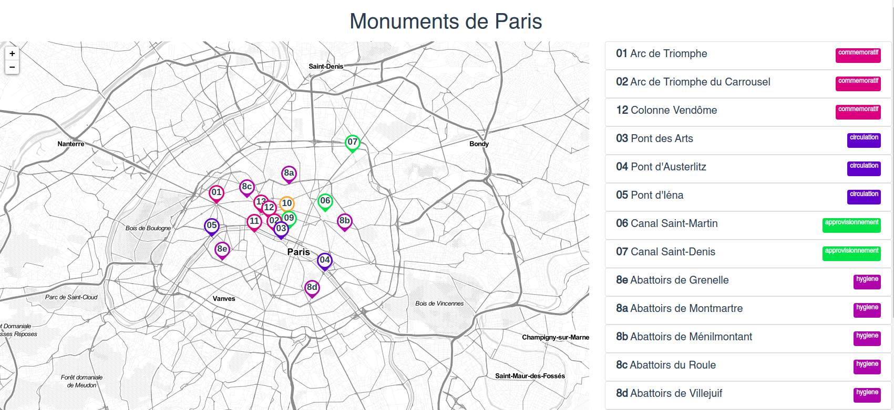

# Les monuments 🏰 de Paris 🌁 de l'époque napoléonienne



## Projet

Projet pédagogique sur [Vue.Js](https://vuejs.org/) et [Leaflet](https://leafletjs.com/)

Les icones s'inspirent de ce [Fiddle](https://jsfiddle.net/a08oek3w/2/)

### Monuments

* Arc de Triomphe (Etoile)
* Arc de Triomphe (Carrousel)
* Colonne de la Grande Armée / Colonne Vendôme
* Abattoirs de Paris: Grenelle, Gobelins, Montmartre, ...
* Ponts: Austerlitz, Iéna, des Arts
* Palais Brongniart
* Eglise de la Madeleine
* Canal Saint-Martin, Saint-Denis

Plus de détails dans le ficher des [Sites](./sites.json)

### installation et usage

### Installation

Assurez-vous d'avoir installé @vue/cli3 ou plus.
Copiez/Clonez ensuite le REPO Github

```shell
yarn install
```

```shell
yarn serve
```

### Dépendances et Librairies

* Vue
* Leaflet
* Bootstrap 4 / BootstrapVue

## Demo

A noter que dans mon cas, le fond se décale systématiquement vers la droite,
il faut rajouter la règle css suivante :

```css
.marker-pin::after {
    right: 3px;
}
```

[Monuments de Paris](https://jsfiddle.net/bcotteret/4j70tx5f/)
